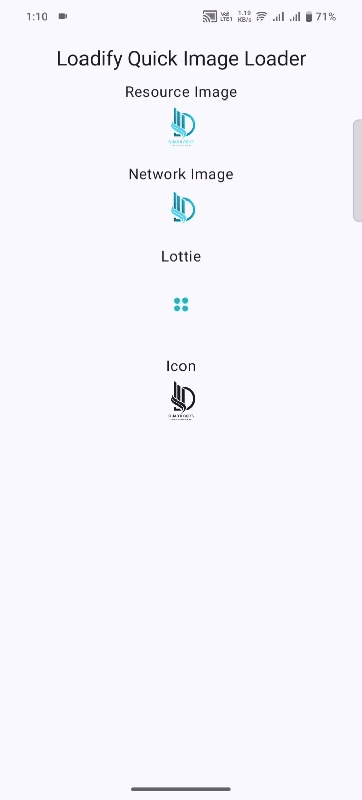

# Loadify
**Loadify** is a powerful and versatile Jetpack Compose library designed for quickly loading resource images, network images, Lottie animations, GIFs, and icons with minimal setup. It streamlines the image loading process.




## Features

- Load resource images with ease.
- Load network images directly into Compose layouts.
- Display Lottie animations.
- Easily handle icons (both local and network).
- Placeholder support for loading and error states.

## Installation

To use **Loadify** in your Android project, follow these steps:

### Step 1: Add the SDK 

In your project’s `build.gradle` file, add the sdk:
```kotlin
implementation("com.lib.quad.logixs:loadify:1.0.0")
```
### Step 2: Add maven
In your project’s `settings.gradle` file, add the maven:
```kotlin
repositories {
     maven { url "https://jitpack.io" }
}
```

## How To Use
Load Local Image Example:
```kotlin
      // Resource Image Example
        Loadify(image = R.drawable.logo, modifier = Modifier.size(50.dp))

```
Load Network Image Example
```kotlin
        // Network Image Example
        Loadify(
            image = "https://example.com/test.png",
            modifier = Modifier.size(50.dp)
        )
```
Load Lottie or Gif Example
```kotlin
        // Lottie Animation Example
        Loadify(
            image = R.raw.lottie_loader,
            loadifyType = LoadifyType.Lottie,
            placeholder = R.drawable.ic_loader,
            modifier = Modifier.size(80.dp)
        )
```
Load Icon Example
```kotlin
        // Icon Example
        Loadify(
            image = R.drawable.logo,
            loadifyType = LoadifyType.Icon,
            modifier = Modifier.size(50.dp)
        )
```

### Loadify Parameters

-  `image: ` The resource ID, URL, or raw resource representing the image to load.

-  `modifier: ` The Modifier to apply to the image component.

-  `loadifyType: ` Specifies the type of content to load. It supports Image, Icon, and Lottie.

-  `placeholder: ` A resource to display while the image is loading or in case of error.

-  `contentScale: ` Determines how the image should be scaled. Supports different ContentScale types like Crop, Fit, etc.


## Contribution

Feel free to open issues or submit pull requests to help improve Loadify.

## License

This project is licensed under the MIT License. See the LICENSE file for details.


